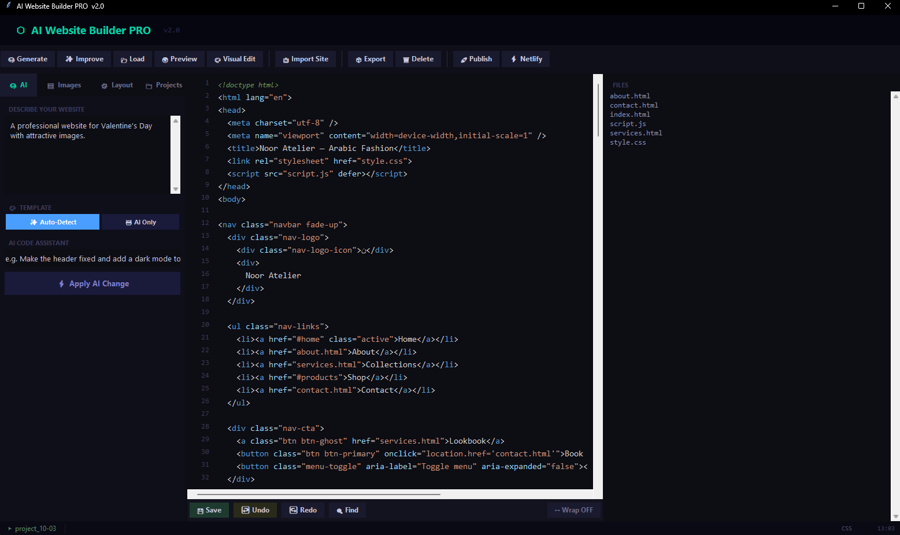
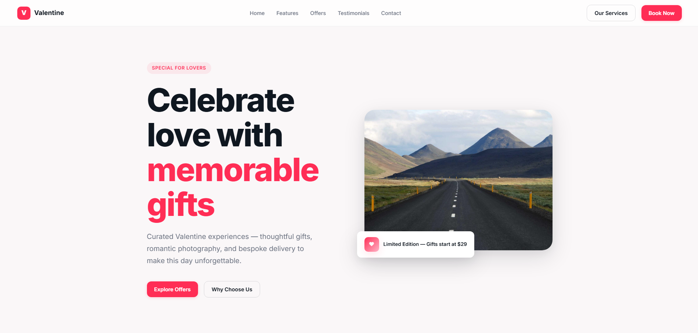

# 🚀 AI Website Builder Pro

AI-powered desktop application for generating, editing, and deploying professional websites.

---

## 📸 Screenshots

### Application Interface



### Generated Website Example



---

## ✨ Features

- AI Website Generation
- AI Content Improvement
- Visual Website Editor
- Integrated Code Editor
- Live Preview
- Project Management
- Image Management
- GitHub Publishing
- Netlify Deployment
- Multi-page Website Generation

---

## 🛠 Technologies

### Programming

- Python

### Frontend

- HTML
- CSS
- JavaScript

### AI Providers

- OpenAI
- Google Gemini
- Anthropic Claude

### Deployment

- GitHub Pages
- Netlify

---

## 📂 Project Structure

```text
core/
features/
ui/
main.py
config.py
```

---

## 🎯 Use Cases

- Business Websites
- Portfolio Websites
- Landing Pages
- Service Websites
- Startup Websites

---

## 👨‍💻 Author

Mohamad Majd Al Baroudi

Information Systems Graduate  
AI Developer | System Developer | Data Analytics

LinkedIn:
https://www.linkedin.com/in/mohamad-majd-al-baroudi/
